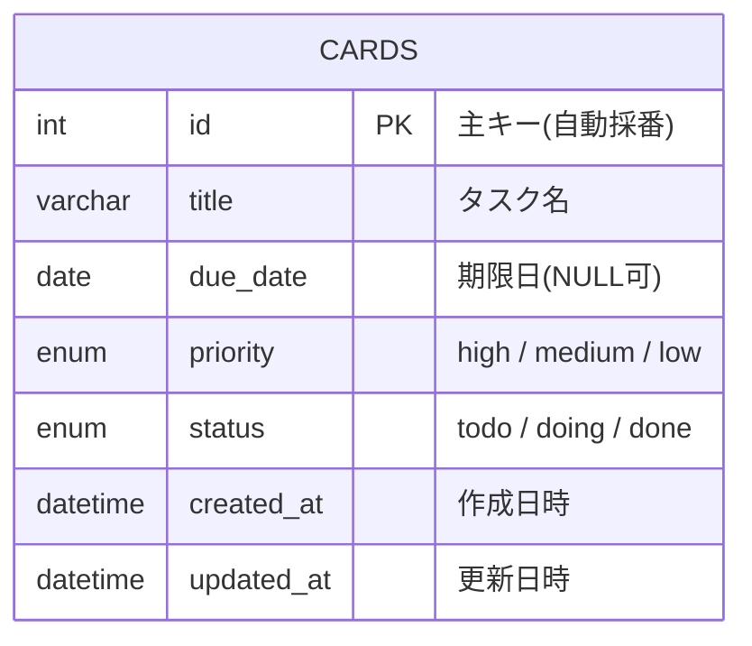

# ER図・データベース設計書

[要件定義書に戻る](./requirements.md)

## 1. 設計方針
今回のスコープでは、ボードは1つ・列は固定3種類のみで、ユーザーが増減させる機能は持たない。そのため、Board・Columnを独立したテーブルにはせず、`cards`テーブル1つに列の情報を`status`として持たせるシンプルな設計とする。

## 2. ER図

## 3. テーブル定義: cards

| カラム名 | 型 | 制約 | 説明 |
|----------|----|----|------|
| id | int | PK, AUTO_INCREMENT | 主キー |
| title | varchar | NOT NULL | タスク名 |
| due_date | date | NULL可 | 期限日 |
| priority | enum('high','medium','low') | NOT NULL, デフォルト 'medium' | 優先度 |
| status | enum('todo','doing','done') | NOT NULL | 列（ステータス） |
| created_at | datetime | NOT NULL | 作成日時 |
| updated_at | datetime | NOT NULL | 更新日時 |

## 4. 拡張時の設計変更方針
複数ボード対応などの拡張を行う場合は、`boards`テーブル・`columns`テーブルを追加し、`cards`テーブルから外部キーで参照する形に発展させる。詳細は[今後の拡張候補](./future.md)を参照。
