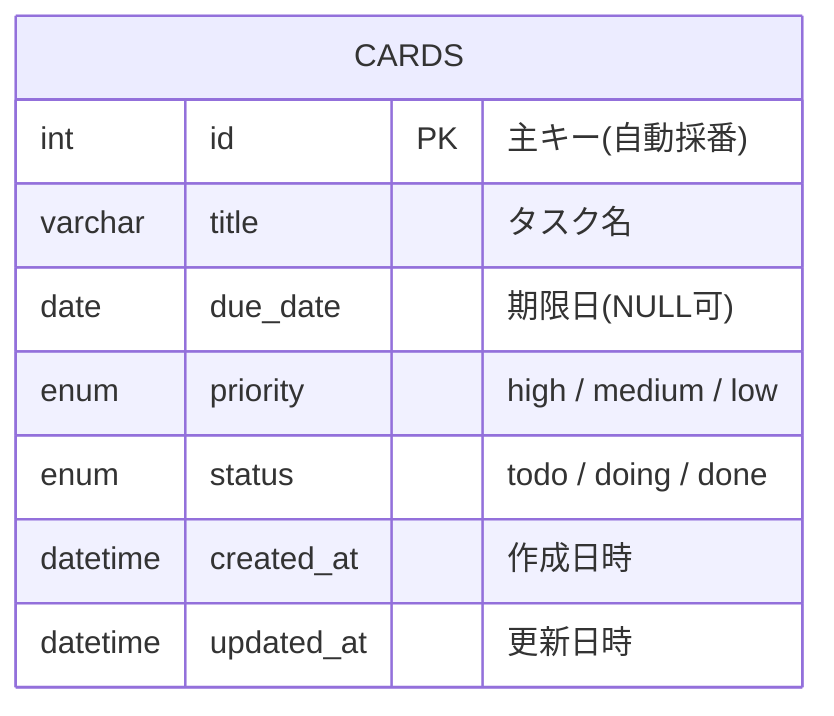

# ER図・データベース設計書

[要件定義書に戻る](./requirements.md)

## 1. 設計方針
今回のスコープでは、ボードは1つ・列は固定3種類のみで、ユーザーが増減させる機能は持たない。そのため、Board・Columnを独立したテーブルにはせず、`cards`テーブル1つに列の情報を`status`として持たせるシンプルな設計とする。

## 2. ER図

```mermaid
erDiagram
    CARDS {
        int id PK "主キー(自動採番)"
        varchar title "タスク名"
        date due_date "期限日(NULL可)"
        enum priority "high / medium / low"
        enum status "todo / doing / done"
        datetime created_at "作成日時"
        datetime updated_at "更新日時"
    }
```

## 3. テーブル定義: cards

| カラム名 | 型 | 制約 | 説明 |
|----------|----|----|------|
| id | bigint | PK, GENERATED ALWAYS AS IDENTITY | 主キー |
| title | varchar | NOT NULL | タスク名 |
| due_date | date | NULL可 | 期限日 |
| priority | varchar（CHECK制約で'high','medium','low'に限定） | NOT NULL, デフォルト 'medium' | 優先度 |
| status | varchar（CHECK制約で'todo','doing','done'に限定） | NOT NULL | 列（ステータス） |
| created_at | timestamp | NOT NULL | 作成日時 |
| updated_at | timestamp | NOT NULL | 更新日時 |

※ PostgreSQLにはMySQLのようなネイティブenum型はあるが列挙値の変更が煩雑なため、本プロジェクトでは`varchar + CHECK制約`で表現する（Java側ではEnum型として扱い、JPAでマッピングする）。

## 4. 拡張時の設計変更方針
複数ボード対応などの拡張を行う場合は、`boards`テーブル・`columns`テーブルを追加し、`cards`テーブルから外部キーで参照する形に発展させる。詳細は[今後の拡張候補](./future.md)を参照。
