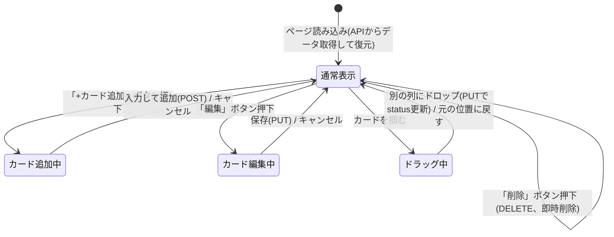
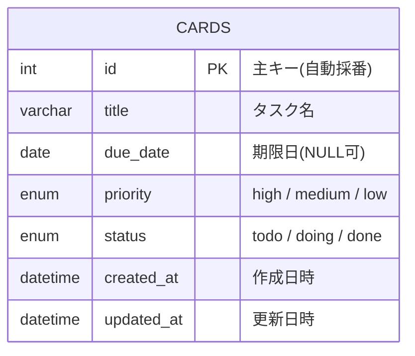

# 要件定義書 - Trello風タスク管理アプリ

## 1. 背景・目的
- 本プロジェクトは、プログラミングスクールの学習課題として作成する。
- 目的は「実際に動くアプリを一つ完成させることで、Web開発の基礎を体験・習得すること」であり、業務課題の解決を目的とした案件ではない。
- 特に、フロントエンド（画面）・バックエンド（API）・データベースの3層に分かれた構成（3層アーキテクチャ）を実際に手を動かして構築し、それぞれの役割と連携方法を学ぶことを重視する。
- 題材として、直感的に理解しやすく学習効果の高い「Trello風のタスク管理アプリ（カードを列ごとに管理する）」を採用する。

## 2. 想定利用者
- 開発者本人（自分専用のタスク管理ツールとして使う）
- ローカル環境（自分のPC上）でフロントエンド・バックエンド・データベースをすべて起動して利用する前提（インターネット上への公開・複数人利用は想定しない）

## 3. ユースケース
アクターは「利用者（自分自身）」の1名のみ。

| ID | ユースケース名 | 概要 | 事前条件 | 事後条件 |
|----|----------------|------|----------|----------|
| UC-1 | カードを追加する | 任意の列にタスク名を入力し、新しいカードを作成する | フロントエンド・バックエンド・DBがすべて起動している | 入力した内容でカードが列に追加され、バックエンドAPI経由でMySQLに保存される |
| UC-2 | カードを編集する | 既存カードのタスク名・期限日・優先度を書き換える | 編集対象のカードが存在する | カードの内容が更新され、MySQLに保存される |
| UC-3 | カードを削除する | 不要になったカードを削除する | 削除対象のカードが存在する | カードが画面から消え、MySQL上のレコードも削除される |
| UC-4 | カードを別の列に移動する | ドラッグ&ドロップ、またはボタン操作でカードのステータスを変える | 移動対象のカードが存在する | カードが移動先の列に表示され、MySQL上のstatusが更新される |
| UC-5 | 優先度・期限日を設定する | カード作成・編集時に優先度（高/中/低）と期限日を設定する | カードの追加・編集画面が開いている | 設定値がカードに反映され、色分け等で表示される |
| UC-6 | ページ再訪問時にデータを復元する | ブラウザを再度開いたときに、以前の状態を再現する | MySQLに保存済みデータがある | フロントエンドがバックエンドAPIを呼び出し、取得したデータがそのまま画面に表示される |

## 4. スコープ（今回作る範囲）

### 4.1 含む機能（MVP）
| # | 機能 | 内容 |
|---|------|------|
| 1 | 列の表示 | 「To Do」「Doing」「Done」の3列を画面に表示する |
| 2 | カード追加 | 任意の列にタスク名（テキスト）を入力してカードを追加できる |
| 3 | カード削除 | 不要になったカードを削除できる |
| 4 | カード移動 | カードを別の列に移動できる（ドラッグ&ドロップ、またはボタン操作） |
| 5 | データ保存 | バックエンドAPI経由でMySQLにデータを保存し、ページを開き直しても内容が復元される |
| 6 | カード編集 | カードのタスク名を後から書き換えられる |
| 7 | 期限日 | カードに期限日（日付）を設定・表示できる |
| 8 | 優先度 | カードに優先度（高・中・低）を設定し、色分けして表示する |
| 9 | バックエンドAPI | フロントエンドからのリクエストを受け、カードのCRUD処理を行うREST APIを提供する |
| 10 | データベース | MySQLにカード情報を永続化する |

### 4.2 含まない機能（今回は対象外）
- ユーザー登録・ログイン機能（利用者は自分1人のみのため）
- 複数ボードの作成・切り替え
- 担当者・ラベルなどのカード詳細情報
- インターネット上への公開・複数人での共同編集（ローカル環境での利用に限定）

## 5. 制約事項
- 開発者1名によるスクール学習課題であり、開発期間・工数に限りがある
- 学習目的のため、フロントエンドはフレームワークを使わず素のHTML/CSS/JavaScriptで実装する
- バックエンドはNode.js + Express、データベースはMySQLに限定し、他の言語・DB製品は採用しない
- 開発・実行環境はローカルPC上に限定し、クラウドサーバーへのデプロイ・公開は行わない
- ユーザー登録・ログイン機能は持たず、利用者は開発者本人1人のみを前提とする

## 6. 受け入れ基準（この機能ができたと判断する条件）
| # | 機能 | 受け入れ基準 |
|---|------|--------------|
| 1 | 列の表示 | 画面を開いたとき、「To Do」「Doing」「Done」の3列が常に表示されている |
| 2 | カード追加 | テキストを入力して追加ボタンを押すと、対象の列の末尾に新しいカードが表示される。空文字では追加できない |
| 3 | カード削除 | 削除ボタンを押すと、そのカードが画面から消え、MySQL上のレコードも削除される |
| 4 | カード移動 | カードを別の列にドラッグ&ドロップ（またはボタン操作）すると、元の列から消え、移動先の列に表示され、DB上のstatusも更新される |
| 5 | データ保存 | カードの追加・編集・削除・移動のいずれかを行った後にページをリロードしても、バックエンドAPI経由でDBから取得した直前の状態がそのまま復元される |
| 6 | カード編集 | 編集ボタンを押すとタスク名を書き換えられる状態になり、保存すると新しい内容が表示とDBの両方に反映される |
| 7 | 期限日 | カード作成・編集時に日付を選択でき、選択した日付がカード上に表示される。未設定でも保存・表示ができる |
| 8 | 優先度 | 「高・中・低」のいずれかを選択でき、選択した優先度に応じてカードの色が変わる。未選択時は「中」がデフォルトで設定される |
| 9 | バックエンドAPI | フロントエンドから送信したリクエストに対し、正しいHTTPステータスコードとJSONレスポンスが返る |
| 10 | データベース | サーバーを再起動しても、MySQLに保存されたデータは消えずに残っている |

## 7. 非機能要件
| 分類 | 内容 |
|------|------|
| 動作環境 | フロントエンドは最新版のGoogle Chromeで動作すること。バックエンドはNode.js（LTS版）で動作すること |
| 環境構築 | ローカルPC上でNode.jsサーバーとMySQLを起動できれば動作すること（大がかりなインフラ構築は不要） |
| 想定データ量 | カード枚数は数十枚程度を想定（大量データでの性能検証は対象外） |
| 保守性 | 変数名・関数名は役割が分かる名前を付け、他人が読んでも処理内容を追えるコードにする |
| ユーザビリティ | 画面表示・操作メッセージはすべて日本語とし、直感的に操作できるボタン配置にする |
| セキュリティ | DBの接続情報（パスワード等）はコードに直接書かず、環境変数（.envファイル）で管理する。SQLインジェクション対策としてプレースホルダ（パラメータ化クエリ）を使用する。入力したテキストをそのまま画面に表示する際にHTMLとして解釈されない対策（XSS対策の基礎）を行う |
| デバイス対応 | PCのブラウザでの利用を前提とし、スマートフォン対応（レスポンシブデザイン）は必須としない |

## 8. システム構成（3層アーキテクチャ）
```
┌─────────────────────────┐
│  フロントエンド           │
│  (HTML / CSS / JavaScript)│
└────────────┬─────────────┘
             │ HTTP (fetch, JSON)
             ▼
┌─────────────────────────┐
│  バックエンド             │
│  (Node.js + Express)      │
│  REST APIとしてCRUDを提供  │
└────────────┬─────────────┘
             │ SQL
             ▼
┌─────────────────────────┐
│  データベース             │
│  (MySQL)                  │
└─────────────────────────┘
```
- フロントエンドは画面表示と、ユーザー操作をAPIリクエストに変換する役割のみを持つ（データの永続化は行わない）
- バックエンドはリクエストを受け取り、入力チェックを行った上でMySQLに対してSQLを発行する
- データベースはカード情報を永続的に保持する

## 9. 技術選定
| 項目 | 採用technology | 選定理由 |
|------|--------------|----------|
| 画面構築 | HTML / CSS | フレームワークを使わず基礎構文を理解するため |
| 画面の動き・API通信 | JavaScript（フレームワーク不使用）+ fetch API | 学習目的のため、React/Vue等の抽象化に頼らず素のJavaScriptでDOM操作とHTTP通信の基礎を理解する |
| カード移動の実装 | HTML5 Drag and Drop API | 追加ライブラリなしでドラッグ&ドロップを実装し、Web標準APIの使い方を学ぶため |
| バックエンド | Node.js + Express | フロントエンドと同じJavaScriptで学べるため学習コストが低く、シンプルなREST API構築に向いている |
| データベース | MySQL | 実務でよく使われるRDBの一つであり、SQLとリレーショナルデータ設計の基礎を学べるため |

## 10. API仕様（エンドポイント一覧）
| メソッド | パス | 内容 |
|----------|------|------|
| GET | /api/cards | すべてのカードを取得する |
| POST | /api/cards | 新しいカードを作成する（タスク名・期限日・優先度・列を指定） |
| PUT | /api/cards/:id | 指定したカードの内容（タスク名・期限日・優先度・列）を更新する |
| DELETE | /api/cards/:id | 指定したカードを削除する |

- カードの移動も`PUT /api/cards/:id`で列（status）を書き換えることで実現する（専用エンドポイントは設けない）
- レスポンスはJSON形式で返す

## 11. UI・画面構成

### 11.1 画面イメージ（ラフ）
```
┌────────────────┬────────────────┬────────────────┐
│     To Do      │     Doing      │     Done       │
├────────────────┼────────────────┼────────────────┤
│ [+ カード追加]  │ [+ カード追加]  │ [+ カード追加]  │
│ ┌────────────┐ │ ┌────────────┐ │                │
│ │ タスクA     │ │ │ タスクB     │ │                │
│ │ 優先度: 高  │ │ │ 優先度: 中  │ │                │
│ │ 期限: 7/25  │ │ │ 期限: 7/28  │ │                │
│ │[編集][削除][→]│ │[編集][削除][→]│ │                │
│ └────────────┘ │ └────────────┘ │                │
└────────────────┴────────────────┴────────────────┘
```
本アプリは画面遷移を伴わない1画面（SPA）構成とし、以下の「状態」がその画面の中で切り替わる。

### 11.2 画面の状態遷移


## 12. データモデル（ER図 / テーブル設計）
今回のスコープでは、ボードは1つ・列は固定3種類のみで、ユーザーが増減させる機能は持たない。そのため、Board・Columnを独立したテーブルにはせず、`cards`テーブル1つに列の情報を`status`として持たせるシンプルな設計とする。



- 複数ボード対応などの拡張を行う場合は、`boards`テーブル・`columns`テーブルを追加し、`cards`テーブルから外部キーで参照する形に発展させる（詳細は「13. 今後の拡張候補」を参照）

## 13. 今後の拡張候補（MVP完成後に検討）
- ラベル・タグ機能
- 複数ボード対応（`boards`・`columns`テーブルを追加し、`cards`から外部キー参照する設計に変更）
- ユーザー登録・ログイン機能（複数人での利用）
- スマホ対応（レスポンシブデザイン）
- 期限超過カードの強調表示（例: 赤枠にする）
- 本番環境へのデプロイ（クラウドサーバー・マネージドDBの利用）
