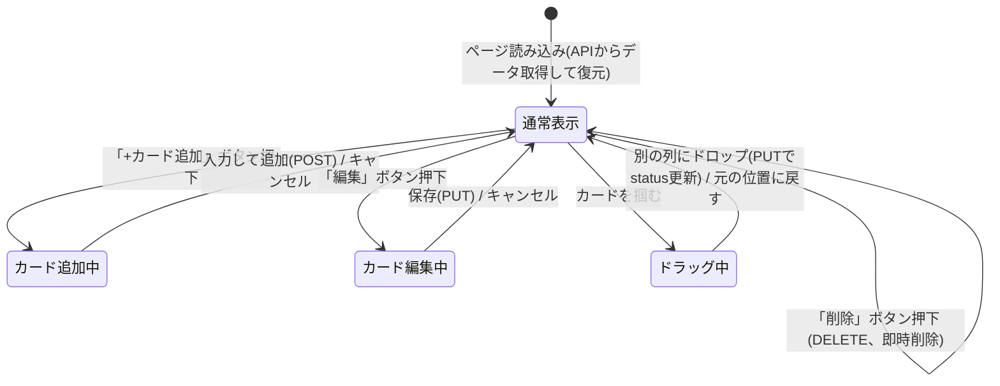

# 画面設計書（画面仕様・画面遷移）

[要件定義書に戻る](./requirements.md)

## 1. 画面構成の前提
本アプリは画面遷移を伴わない1画面（SPA）構成とし、以下の「状態」がその画面の中で切り替わる。

## 2. 画面イメージ（ラフ）
```
┌────────────────┬────────────────┬────────────────┐
│     To Do      │     Doing      │     Done       │
├────────────────┼────────────────┼────────────────┤
│ [+ カード追加]  │ [+ カード追加]  │ [+ カード追加]  │
│ ┌────────────┐ │ ┌────────────┐ │                │
│ │ タスクA     │ │ │ タスクB     │ │                │
│ │ 優先度: 高  │ │ │ 優先度: 中  │ │                │
│ │ 期限: 7/25  │ │ │ 期限: 7/28  │ │                │
│ │[編集][削除][→]│ │[編集][削除][→]│ │                │
│ └────────────┘ │ └────────────┘ │                │
└────────────────┴────────────────┴────────────────┘
```

## 3. 画面の状態遷移


## 4. 画面項目・操作仕様

| 状態 | 表示項目 | 操作 | 呼び出すAPI |
|------|----------|------|--------------|
| 通常表示 | 3列（To Do / Doing / Done）、各列のカード一覧 | ページ読み込み時にデータ取得 | GET /api/cards |
| カード追加中 | タスク名入力欄、期限日入力欄、優先度選択欄 | 入力して追加 / キャンセル | POST /api/cards |
| カード編集中 | タスク名・期限日・優先度の編集欄（既存値が初期表示） | 保存 / キャンセル | PUT /api/cards/:id |
| ドラッグ中 | カードを掴んで移動中の見た目 | 別列へドロップ / 元の位置に戻す | PUT /api/cards/:id |
| （通常表示内） | カードごとの削除ボタン | 削除ボタン押下（即時削除、確認なし） | DELETE /api/cards/:id |

API詳細は[API仕様書](./api.md)を参照。
